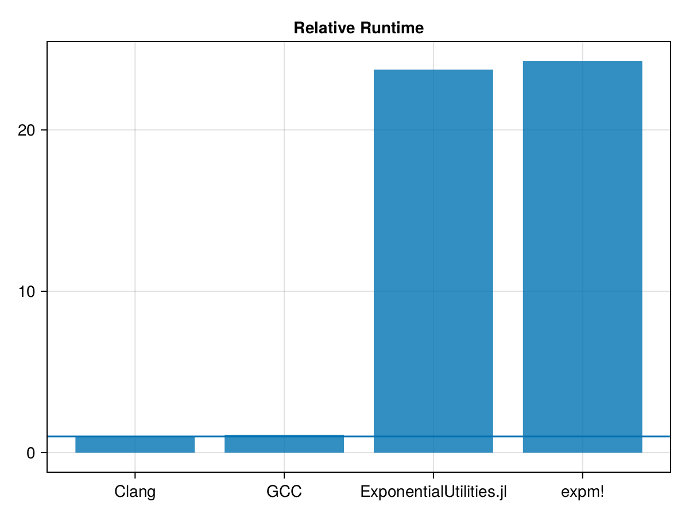

+++
title = "Competing with C++ with Julia in multithreaded, allocating code"
date = Date(2023, 11, 26)
rss = "Improving performance with multithreaded workloads"
+++


# Benchmarking test case

Our benchmark test case will be applying ForwardMode AD with dual numbers with dynamically sized square matrices of size 2x2...8x8 on multiple threads.
We'll test no duals, and dual sizes `1:8` for single derivatives, and `1:8` by `1:2` for second derivatives. This gives us a large number of combinations, which increases the working memory we need a bit.
We'll iterate over a range of scale factors, to hit different code-paths based on the op-norm of the matrices. For each scale factor, we'll iterate over all tested matrices to increase the working set of memory, to simulate more realistic workloads that may (for example) be solving a large number of affine differential equations as part of an optimization problem.
For Julia, we'll be using `ForwardDiff.jl`, and for C++ we use an implementation from the LoopModels supporting math library.

The function we're benchmarking:
```julia
using Base.Threads

# utilities for dealing with nested tuples
# we use nested instead of flat tuples to avoid heuristics
# that avoid specializing on long tuples
rmap(f, ::Tuple{}) = ()
rmap(f::F, x::Tuple) where {F} = map(f, x)
rmap(f::F, x::Tuple{Vararg{Tuple,K}}) where {F,K} = map(Base.Fix1(rmap, f), x)
rmap(f, ::Tuple{}, ::Tuple{}) = ()
rmap(f::F, x::Tuple, y::Tuple) where {F} = map(f, x, y)
rmap(f::F, x::Tuple{Vararg{Tuple,K}}, y::Tuple{Vararg{Tuple,K}}) where {F,K} = map((a,b)->rmap(f,a,b), x, y)
# rmaptnum applies `f` to a tuple of non - tuples
rmaptnum(f, ::Tuple{}) = ()
rmaptnum(f::F, x::Tuple{Vararg{Tuple{Vararg}}}) where {F} = map(f, x)
rmaptnum(f::F, x::Tuple{Vararg{Tuple{Vararg{Tuple}}}}) where {F} = map(Base.Fix1(rmaptnum,f), x)

struct SumScaleMatrixExponential{F}
    f!::F
    s::Float64
end
function (sme::SumScaleMatrixExponential)(B, A)
    for i in eachindex(B, A)
        B[i] = sme.s * A[i]
    end
    sme.f!(B)
    return sum(B)
end

function do_singlethreaded_work!(f!::F, Bs, As, r) where {F}
    ret = rmaptnum(zero ∘ eltype ∘ eltype, Bs)
    for s in r
        incr = rmap(SumScaleMatrixExponential(f!, s), Bs, As)
        ret = rmap(+, ret, rmaptnum(sum,incr))
    end
    return ret
end

function do_multithreaded_work!(f!::F, Bs, As, r) where {F}
    nt = Threads.nthreads(:default)
    nt > 1 || return do_singlethreaded_work!(f!, Bs, As, r)
    tasks = Vector{Task}(undef, nt)
    for n in 1:nt        
        subrange = r[n:nt:end] # stride to balance opnorms across threads
        Bsc = n == nt ? Bs : rmap(copy, Bs)
        tasks[n] = Threads.@spawn do_singlethreaded_work!($f!, $Bsc, $As, $subrange)
    end
    _ret = rmaptnum(zero ∘ eltype ∘ eltype, Bs)
    ret::typeof(_ret) = Threads.fetch(tasks[1])
    for n in 2:nt
        ret = rmap(+, ret, Threads.fetch(tasks[n]))
    end
    return ret
end
```

```julia
do_multithreaded_work! (generic function with 1 method)
```


We need some boiler plate to deal with large numbers of different types in stable manner by iterating over tuples.
The code calculates a matrix exponential after scaling an input, and accumulates a sum of the results.
Lets create some test case matrices:
```julia
using ForwardDiff
max_size = 5;
d(x, n) = ForwardDiff.Dual(x, ntuple(_->randn(), n))
function dualify(A, n, j)
  n == 0 && return A
  j == 0 ? d.(A, n) : d.(d.(A, n), j)
end
randdual(n, dinner, douter) = dualify(rand(n,n), dinner, douter)
As = map((0,1,2)) do dout # outer dual
  map(ntuple(identity,Val(9)).-1) do din # inner dual
    map(ntuple(identity,Val(max_size-1)).+1) do n # matrix size
      randdual(n,din,dout)
    end
  end
end;
Bs = rmap(similar, As);
```


Lets set C++ as a baseline with this.
We'll base our implementation on [StaticArrays.exp](https://github.com/JuliaArrays/StaticArrays.jl/blob/72d2bd3538235c9162f630a5130112b83eaa0af7/src/expm.jl#L75-L129), as this implementation is simpler than the one from `ExponentialUtilities.jl`. The core of our C++ implementation is only 50 lines of code:
```cpp
template <typename T> constexpr void expm(MutSquarePtrMatrix<T> A) {
  ptrdiff_t n = ptrdiff_t(A.numRow()), s = 0;
  SquareMatrix<T> A2{SquareDims<>{{n}}}, U_{SquareDims<>{{n}}};
  MutSquarePtrMatrix<T> U{U_};
  if (double nA = opnorm1(A); nA <= 0.015) {
    A2 << A * A;
    U << A * (A2 + 60.0 * I);
    A << 12.0 * A2 + 120.0 * I;
  } else {
    SquareMatrix<T> B{SquareDims<>{{n}}};
    if (nA <= 2.1) {
      A2 << A * A;
      containers::TinyVector<double, 5> p0, p1;
      if (nA > 0.95) {
        p0 = {1.0, 3960.0, 2162160.0, 302702400.0, 8821612800.0};
        p1 = {90.0, 110880.0, 3.027024e7, 2.0756736e9, 1.76432256e10};
      } else if (nA > 0.25) {
        p0 = {1.0, 1512.0, 277200.0, 8.64864e6};
        p1 = {56.0, 25200.0, 1.99584e6, 1.729728e7};
      } else {
        p0 = {1.0, 420.0, 15120.0};
        p1 = {30.0, 3360.0, 30240.0};
      }
      evalpoly(B, U, A2, p0);
      U << A * B;
      evalpoly(A, B, A2, p1);
    } else {
      // s = std::max(unsigned(std::ceil(std::log2(nA / 5.4))), 0);
      s = nA > 5.4 ? log2ceil(nA / 5.4) : 0;
      if (s & 1) {       // we'll swap `U` and `A` an odd number of times
        std::swap(A, U); // so let them switch places
        A << U * exp2(-s);
      } else if (s > 0) A *= exp2(-s);
      A2 << A * A;
      // here we take an estrin (instead of horner) approach to cut down flops
      SquareMatrix<T> A4{A2 * A2}, A6{A2 * A4};
      B << A6 * (A6 + 16380 * A4 + 40840800 * A2) +
             (33522128640 * A6 + 10559470521600 * A4 + 1187353796428800 * A2) +
             32382376266240000 * I;
      U << A * B;
      A << A6 * (182 * A6 + 960960 * A4 + 1323241920 * A2) +
             (670442572800 * A6 + 129060195264000 * A4 +
              7771770303897600 * A2) +
             64764752532480000 * I;
    }
  }
  containers::tie(A, U) << containers::Tuple(A + U, A - U);
  LU::ldiv(U, MutPtrMatrix<T>(A));
  for (; s--; std::swap(A, U)) U << A * A;
}
```
Now, to compile it
```julia
withenv("CXX"=>"clang++") do # clang++ is much faster than g++ here
  @time run(`cmake -S . -B buildclang -DCMAKE_BUILD_TYPE=Release -DCMAKE_UNITY_BUILD=ON`)
  @time run(`cmake --build buildclang`)
end
```

```julia
-- The CXX compiler identification is Clang 17.0.5
-- Detecting CXX compiler ABI info
-- Detecting CXX compiler ABI info - done
-- Check for working CXX compiler: /bin/clang++ - skipped
-- Detecting CXX compile features
-- Detecting CXX compile features - done
-- Found Git: /bin/git (found version "2.43.0") 
-- CPM: Adding package PackageProject.cmake@1.8.0 (v1.8.0 at /home/chriselr
od/.cache/CPM/packageproject.cmake/987b02f8a9fe04de3c43e0e7a1afbb29c87adc5e
)
-- Performing Test VEC512
-- Performing Test VEC512 - Success
-- Using 2 batch size
-- Configuring done (2.2s)
-- Generating done (0.0s)
-- Build files have been written to: /home/chriselrod/Documents/progwork/cx
x/MatrixExp/buildclang
  2.200352 seconds (184 allocations: 205.039 KiB)
[  0%] Built target Math
[  7%] Building CXX object CMakeFiles/MatrixExp.dir/Unity/unity_12_cxx.cxx.
o
[ 35%] Building CXX object CMakeFiles/MatrixExp.dir/Unity/unity_9_cxx.cxx.o
[ 35%] Building CXX object CMakeFiles/MatrixExp.dir/Unity/unity_8_cxx.cxx.o
[ 35%] Building CXX object CMakeFiles/MatrixExp.dir/Unity/unity_11_cxx.cxx.
o
[ 35%] Building CXX object CMakeFiles/MatrixExp.dir/Unity/unity_10_cxx.cxx.
o
[ 42%] Building CXX object CMakeFiles/MatrixExp.dir/Unity/unity_7_cxx.cxx.o
[ 57%] Building CXX object CMakeFiles/MatrixExp.dir/Unity/unity_6_cxx.cxx.o
[ 57%] Building CXX object CMakeFiles/MatrixExp.dir/Unity/unity_5_cxx.cxx.o
[ 64%] Building CXX object CMakeFiles/MatrixExp.dir/Unity/unity_3_cxx.cxx.o
[ 78%] Building CXX object CMakeFiles/MatrixExp.dir/Unity/unity_2_cxx.cxx.o
[ 78%] Building CXX object CMakeFiles/MatrixExp.dir/Unity/unity_4_cxx.cxx.o
[ 85%] Building CXX object CMakeFiles/MatrixExp.dir/Unity/unity_1_cxx.cxx.o
[ 92%] Building CXX object CMakeFiles/MatrixExp.dir/Unity/unity_0_cxx.cxx.o
[100%] Linking CXX shared library libMatrixExp.so
[100%] Built target MatrixExp
  4.461920 seconds (173 allocations: 4.047 KiB)
Process(`cmake --build buildclang`, ProcessExited(0))
```


This compiled all combinations we need; lets wrap them so we can call them.
```julia
const libExpMatClang = joinpath(@__DIR__, "buildclang/libMatrixExp.so")
clangexpm!(A::Matrix{Float64}) = @ccall libExpMatClang.expmf64(
  A::Ptr{Float64},
  size(A, 1)::Clong
)::Nothing
for n = 1:8
  sym = Symbol(:expmf64d, n)
  @eval clangexpm!(
    A::Matrix{ForwardDiff.Dual{T,Float64,$n}}
  ) where {T} = @ccall libExpMatClang.$sym(
    A::Ptr{Float64},
    size(A, 1)::Int
  )::Nothing
  for i = 1:2
    sym = Symbol(:expmf64d, n, :d, i)
    @eval clangexpm!(
      A::Matrix{ForwardDiff.Dual{T1,ForwardDiff.Dual{T0,Float64,$n},$i}}
    ) where {T0,T1} = @ccall libExpMatClang.$sym(
      A::Ptr{Float64},
      size(A, 1)::Int
    )::Nothing
  end
end
```


So, now, let's set the baseline:
```julia
testrange = range(0.001, stop = 6.0, length=30_000);
rescpp = @time @eval do_multithreaded_work!(clangexpm!, Bs, As, testrange);
t_clang = @elapsed do_multithreaded_work!(clangexpm!, Bs, As, testrange)
```

```julia
4.059012 seconds (5.98 M allocations: 804.047 MiB, 3.32% gc time, 2708.58% compilation time)
0.51463161
```


Great, now for our Julia implementations. While we'll also base our Julia code on this implemtantion, to start with we'll first try `ExponentialUtilities.jl` to see how it compares.
`ExponentialUtilities.exponential!` is likely what most people will reach for once they find that `Base.exp(::AbstractMatrix)` doesn't support `ForwardDiff.Dual` numbers:
```julia
using ForwardDiff, Test
A = rand(4, 4)
@test_throws MethodError ForwardDiff.gradient(sum∘exp, A)
using ExponentialUtilities
ForwardDiff.gradient(sum∘exponential!∘copy, A); # no throw
```


It could be this just works great and we can go home/end the blog post early. =)
So, let's see how it compares.
```julia
res = @time do_multithreaded_work!(exponential!, Bs, As, testrange);
t_exputils = @elapsed do_multithreaded_work!(exponential!, Bs, As, testrange)
```

```julia
210.769474 seconds (255.65 M allocations: 219.477 GiB, 7.03% gc time, 3428.05% compilation time)
9.691126459
```


Oof -- compare both that compile time, and the runtime!

Lets confirm that our answers match.
```julia
approxd(x, y) = isapprox(x, y)
function approxd(x::ForwardDiff.Dual, y::ForwardDiff.Dual)
  approxd(x.value, y.value) && approxd(Tuple(x.partials), Tuple(y.partials))
end
approxd(x::Tuple, y::Tuple) = all(map(approxd, x, y))
@test approxd(res, rescpp)
```

```julia
Test Passed
```


Great. Now, let's visualize where we stand in terms of performance.
```julia
using CairoMakie
function cmpplot(labels, times)
  f = Figure()
  ax = Axis(f[1,1],
    title = "Relative Runtime",
    xticks=(eachindex(labels), labels)
  )
    barplot!(ax, eachindex(times), times)
    hlines!(ax, [1])
  f
end
cmpplot(["Clang", "ExponentialUtilities.jl"], [1.0, t_exputils/t_clang])
```


Okay, lets try a Julia implementation mirroring our C++ code.
```julia
using LinearAlgebra
#My C++ `opnorm` implementation only looks at Dual's values
#so lets just go ahead and copy that optimization here.
_deval(x) = x
_deval(x::ForwardDiff.Dual) = _deval(ForwardDiff.value(x))
function opnorm1(A)
  n = _deval(zero(eltype(A)))
  @inbounds for j in axes(A, 2)
    s = _deval(zero(eltype(A)))
    @simd for i in axes(A, 1)
      s += abs(_deval(A[i, j]))
    end
    n = max(n, s)
  end
  return n
end

#Let's also immediately implement our own `evalpoly` to cut down
#allocations. `B` contains the result, `A` is a temporary
#that we reuse(following the same approach as in C++)
function matevalpoly!(B, A, C, t::NTuple, N)
  @assert N > 1
  if isodd(N)
    A, B = B, A
  end
  B .= t[1] .* C
  @view(B[diagind(B)]) .+= t[2]
  for n in 3:N
    A, B = B, A
    mul!(B, A, C)
    @view(B[diagind(B)]) .+= t[n]
  end
end

log2ceil(x::Float64) =
  (reinterpret(Int, x) - 1) >> Base.significand_bits(Float64) - 1022

function expm!(A::AbstractMatrix)
  N = size(A, 1)
  s = 0
  N == size(A, 2) || error("Matrix is not square.")
  A2 = similar(A)
  U = similar(A)
  if (nA = opnorm1(A); nA <= 0.015)
    mul!(A2, A, A)
    mul!(U, A, A2 + 60.0I) # broadcasting doesn't work with `I`
    A .= 12.0 .* A2
    @view(A[diagind(A)]) .+= 120.0
  else
    B = similar(A)
    if nA <= 2.1 #No need to specialize on different tuple sizes
      mul!(A2, A, A)
      if nA > 0.95
        p0 = (1.0, 3960.0, 2162160.0, 302702400.0, 8821612800.0)
        p1 = (90.0, 110880.0, 3.027024e7, 2.0756736e9, 1.76432256e10)
        N = 5
      elseif nA > 0.25
        p0 = (1.0, 1512.0, 277200.0, 8.64864e6, 0.0)
        p1 = (56.0, 25200.0, 1.99584e6, 1.729728e7, 0.0)
        N = 4
      else
        p0 = (1.0, 420.0, 15120.0, 0.0, 0.0)
        p1 = (30.0, 3360.0, 30240.0, 0.0, 0.0)
        N = 3
      end
      matevalpoly!(B, U, A2, p0, N)
      mul!(U, A, B)
      matevalpoly!(A, B, A2, p1, N)
    else
      s = nA > 5.4 ? log2ceil(nA / 5.4) : 0
      if isodd(s) # need to swap
          A, U = U, A # as we have an odd number of swaps at the end
          A .= U .* exp2(-s)
      elseif s > 0
          A .*= exp2(-s)
      end
      mul!(A2, A, A)
      A4 = A2 * A2
      A6 = A2 * A4
      #we use `U` as a temporary here that we didn't
      #need in the C++ code for the estrin - style polynomial
      #evaluation.Thankfully we don't need another allocation!
      @. U = A6 + 16380 * A4 + 40840800 * A2
      mul!(B, A6, U)
      @. B += 33522128640 * A6 + 10559470521600 * A4 + 1187353796428800 * A2
      @view(B[diagind(B)]) .+= 32382376266240000
      mul!(U, A, B)
      # `A` being filled by the answer
      #we use `B` as a temporary here we didn't
      #need in the C++ code
      @. B = 182 * A6 + 960960 * A4 + 1323241920 * A2
      mul!(A, A6, B)
      @. A += 670442572800 * A6 + 129060195264000 * A4 +
              7771770303897600 * A2
      @view(A[diagind(A)]) .+= 64764752532480000
    end
  end
  @inbounds for i = eachindex(A, U)
    A[i], U[i] = A[i] + U[i], A[i] - U[i]
  end
  ldiv!(lu!(U), A)
  for _ in 1:s
    mul!(U, A, A)
    A, U = U, A
  end
end
```

```julia
expm! (generic function with 1 method)
```


This should do roughly the same thing; does it help?
```julia
resexpm = @time @eval do_multithreaded_work!(expm!, Bs, As, testrange);
@test approxd(res, resexpm)
t_expm = @elapsed do_multithreaded_work!(expm!, Bs, As, testrange)
cmpplot(
  ["Clang", "ExponentialUtilities.jl", "expm!"],
  [1.0, t_exputils/t_clang, t_expm/t_clang]
)
```

```julia
41.869529 seconds (107.08 M allocations: 216.104 GiB, 22.80% gc time, 2785.00% compilation time)
```


No, not really.
One of the major issues is that `mul!` is extremely slow for `ForwardDiff.Dual` numbers.
[Julia PR#52038](https://github.com/JuliaLang/julia/pull/52038) will help immensely. However, it'll only be in Julia 1.11, and we're currently still on the latest release, Julia 1.9.4.
So let's implement the newer matrix multiply method here.
```julia
function mulreduceinnerloop!(C, A, B)
    AxM = axes(A, 1)
    AxK = axes(A, 2) # we use two `axes` calls in case of `AbstractVector`
    BxK = axes(B, 1)
    BxN = axes(B, 2)
    CxM = axes(C, 1)
    CxN = axes(C, 2)
    if AxM != CxM
        throw(DimensionMismatch(lazy"matrix A has axes ($AxM,$AxK), matrix C has axes ($CxM,$CxN)"))
    end
    if AxK != BxK
        throw(DimensionMismatch(lazy"matrix A has axes ($AxM,$AxK), matrix B has axes ($BxK,$CxN)"))
    end
    if BxN != CxN
      throw(DimensionMismatch(lazy"matrix B has axes ($BxK,$BxN), matrix C has axes ($CxM,$CxN)"))
    end
    @inbounds for n = BxN, m = AxM
        Cmn = zero(eltype(C))
        for k = BxK
            Cmn = muladd(A[m,k], B[k,n], Cmn)
        end
      C[m,n] = Cmn
    end
  return C
end
function matevalpoly_custommul!(B, A, C, t::NTuple, N)
  @assert N > 1
  if isodd(N)
    A, B = B, A
  end
  B .= t[1] .* C
  @view(B[diagind(B)]) .+= t[2]
  for n in 3:N
    A, B = B, A
    mulreduceinnerloop!(B, A, C)
    @view(B[diagind(B)]) .+= t[n]
  end
end

function expm_custommul!(A::AbstractMatrix)
  N = size(A, 1)
  s = 0
  N == size(A, 2) || error("Matrix is not square.")
  A2 = similar(A)
  U = similar(A)
  if (nA = opnorm1(A); nA <= 0.015)
    mulreduceinnerloop!(A2, A, A)
    mulreduceinnerloop!(U, A, A2 + 60.0I)
    #broadcasting doesn't work with `I`
    A .= 12.0 .* A2
    @view(A[diagind(A)]) .+= 120.0
  else
    B = similar(A)
    if nA <= 2.1
      mulreduceinnerloop!(A2, A, A)
      #No need to specialize on different tuple sizes
      if nA > 0.95
        p0 = (1.0, 3960.0, 2162160.0, 302702400.0, 8821612800.0)
        p1 = (90.0, 110880.0, 3.027024e7, 2.0756736e9, 1.76432256e10)
        N = 5
      elseif nA > 0.25
        p0 = (1.0, 1512.0, 277200.0, 8.64864e6, 0.0)
        p1 = (56.0, 25200.0, 1.99584e6, 1.729728e7, 0.0)
        N = 4
      else
        p0 = (1.0, 420.0, 15120.0, 0.0, 0.0)
        p1 = (30.0, 3360.0, 30240.0, 0.0, 0.0)
        N = 3
      end
      matevalpoly_custommul!(B, U, A2, p0, N)
      mulreduceinnerloop!(U, A, B)
      matevalpoly_custommul!(A, B, A2, p1, N)
    else
      s = nA > 5.4 ? log2ceil(nA / 5.4) : 0
      if isodd(s) # need to swap
        A, U = U, A # as we have an odd number of swaps at the end
        A .= U .* exp2(-s)
      elseif s > 0
        A .*= exp2(-s)
      end
      mulreduceinnerloop!(A2, A, A)
      A4 = mulreduceinnerloop!(similar(A), A2, A2)
      A6 = mulreduceinnerloop!(similar(A), A2, A4)
      #we use `U` as a temporary here that we didn't
      #need in the C++ code for the estrin - style polynomial
      #evaluation.Thankfully we don't need another allocation!
      @. U = A6 + 16380 * A4 + 40840800 * A2
      mulreduceinnerloop!(B, A6, U)
      @. B += 33522128640 * A6 + 10559470521600 * A4 + 1187353796428800 * A2
      @view(B[diagind(B)]) .+= 32382376266240000
      mulreduceinnerloop!(U, A, B)
      #Like in the C++ code, we swap A and U `s` times at the end
      #so if `s` is odd, we pre - swap to end with the original
      # `A` being filled by the answer
      #we use `B` as a temporary here we didn't
      #need in the C++ code
      @. B = 182 * A6 + 960960 * A4 + 1323241920 * A2
      mulreduceinnerloop!(A, A6, B)
      @. A += 670442572800 * A6 + 129060195264000 * A4 +
              7771770303897600 * A2
      @view(A[diagind(A)]) .+= 64764752532480000
    end
  end
  @inbounds for i = eachindex(A, U)
    A[i], U[i] = A[i] + U[i], A[i] - U[i]
  end
  ldiv!(lu!(U), A)
  for _ in 1:s
    mulreduceinnerloop!(U, A, A)
    A, U = U, A
  end
end

# Testing and timing:

resexpmcm = @time @eval do_multithreaded_work!(expm_custommul!, Bs, As, testrange);
@test approxd(res, resexpmcm)
t_expm_custommul = @elapsed do_multithreaded_work!(expm_custommul!, Bs, As, testrange)

cmpplot(
  ["Clang", "ExponentialUtilities.jl", "expm!", "expm_custommul!"],
  [t_clang, t_exputils, t_expm, t_expm_custommul] ./ t_clang
)
```

```julia
24.731013 seconds (65.73 M allocations: 19.822 GiB, 13.65% gc time, 3041.35% compilation time)
```





That does help a lot! But we're still well behind.

Timing shows we're spending a lot of time in GC:
```julia
@time do_multithreaded_work!(expm_custommul!, Bs, As, testrange);
```

```julia
3.475502 seconds (37.40 M allocations: 17.968 GiB, 50.47% gc time)
```


So lets try re-using the same memory through caching preallocations in the task local storage.
```julia
function tlssimilar(A)
  ret = get!(task_local_storage(), A) do
    ntuple(_->similar(A), Val(5))
  end
  return ret::NTuple{5,typeof(A)}
end

function expm_tls!(A::AbstractMatrix)
  N = size(A, 1)
  s = 0
  N == size(A, 2) || error("Matrix is not square.")
  U, B, A2, A4, A6 = tlssimilar(A)
  if (nA = opnorm1(A); nA <= 0.015)
    mulreduceinnerloop!(A2, A, A)
    B .= A2
    @view(B[diagind(B)]) .+= 60.0
    mulreduceinnerloop!(U, A, B)
    #broadcasting doesn't work with `I`
    A .= 12.0 .* A2
    @view(A[diagind(A)]) .+= 120.0
  else
    if nA <= 2.1
      mulreduceinnerloop!(A2, A, A)
      #No need to specialize on different tuple sizes
      if nA > 0.95
        p0 = (1.0, 3960.0, 2162160.0, 302702400.0, 8821612800.0)
        p1 = (90.0, 110880.0, 3.027024e7, 2.0756736e9, 1.76432256e10)
        N = 5
      elseif nA > 0.25
        p0 = (1.0, 1512.0, 277200.0, 8.64864e6, 0.0)
        p1 = (56.0, 25200.0, 1.99584e6, 1.729728e7, 0.0)
        N = 4
      else
        p0 = (1.0, 420.0, 15120.0, 0.0, 0.0)
        p1 = (30.0, 3360.0, 30240.0, 0.0, 0.0)
        N = 3
      end
      matevalpoly_custommul!(B, U, A2, p0, N)
      mulreduceinnerloop!(U, A, B)
      matevalpoly_custommul!(A, B, A2, p1, N)
    else
      s = nA > 5.4 ? log2ceil(nA / 5.4) : 0
      if isodd(s) # need to swap
        A, U = U, A # as we have an odd number of swaps at the end
        A .= U .* exp2(-s)
      elseif s > 0
        A .*= exp2(-s)
      end
      mulreduceinnerloop!(A2, A, A)
      mulreduceinnerloop!(A4, A2, A2)
      mulreduceinnerloop!(A6, A2, A4)
      #we use `U` as a temporary here that we didn't
      #need in the C++ code for the estrin - style polynomial
      #evaluation.Thankfully we don't need another allocation!
      @. U = A6 + 16380 * A4 + 40840800 * A2
      mulreduceinnerloop!(B, A6, U)
      @. B += 33522128640 * A6 + 10559470521600 * A4 + 1187353796428800 * A2
      @view(B[diagind(B)]) .+= 32382376266240000
      mulreduceinnerloop!(U, A, B)
      #Like in the C++ code, we swap A and U `s` times at the end
      #so if `s` is odd, we pre - swap to end with the original
      # `A` being filled by the answer
      #we use `B` as a temporary here we didn't
      #need in the C++ code
      @. B = 182 * A6 + 960960 * A4 + 1323241920 * A2
      mulreduceinnerloop!(A, A6, B)
      @. A += 670442572800 * A6 + 129060195264000 * A4 +
              7771770303897600 * A2
      @view(A[diagind(A)]) .+= 64764752532480000
    end
  end
  @inbounds for i = eachindex(A, U)
    A[i], U[i] = A[i] + U[i], A[i] - U[i]
  end
  ldiv!(lu!(U), A)
  for _ in 1:s
    mulreduceinnerloop!(U, A, A)
    A, U = U, A
  end
end

restls = @time @eval do_multithreaded_work!(expm_tls!, Bs, As, testrange)
@test approxd(res, restls)
t_tls = @elapsed do_multithreaded_work!(expm_tls!, Bs, As, testrange)

cmpplot(
  ["Clang", "ExponentialUtilities.jl", "expm!", "expm_custommul!", "expm_tls!"],[t_clang, t_exputils, t_expm, t_expm_custommul, t_tls] ./ t_clang
)
```

```julia
22.035270 seconds (51.75 M allocations: 3.328 GiB, 9.43% gc time, 3303.12% compilation time)
```


That helps a lot! 
Note
```julia
(t_expm_custommul - t_tls) / t_clang
```

```julia
3.340693936386846
```


The total amount of GC and allocation time we saved from this approach is over 3x the total time C++ required for the entire calculation -- including its own heap allocations and deallocations, plus the actual arithmetic.

I'll stop for now. But the next two suggestions for improving the Julia code would be:
1. Checkout a [ForwardDiff PR](https://github.com/JuliaDiff/ForwardDiff.jl/pull/570) that uses explicit SIMD for partial accumulation.
2. Try [Bumper.jl](https://github.com/MasonProtter/Bumper.jl/), which is a better approach than TLS.


To build the notebook, you need Clang 17 installed on the path and Weave. Checkout [MatrixExp](https://github.com/chriselrod/MatrixExp/), start Julia, and run:
```julia
using Weave
weave("bench_notebook.jmd", informat="markdown", doctype="github")
```

These results were obtained using
```julia
julia> versioninfo()
Julia Version 1.9.4
Commit 8e5136fa29 (2023-11-14 08:46 UTC)
Build Info:

    Note: This is an unofficial build, please report bugs to the project
    responsible for this build and not to the Julia project unless you can
    reproduce the issue using official builds available at https://julialang.org/downloads

Platform Info:
  OS: Linux (x86_64-generic-linux)
  CPU: 36 × Intel(R) Core(TM) i9-10980XE CPU @ 3.00GHz
  WORD_SIZE: 64
  LIBM: libopenlibm
  LLVM: libLLVM-14.0.6 (ORCJIT, cascadelake)
  Threads: 36 on 36 virtual cores
```
Using 36 threads exagerates scaling differences compared to systems with fewer threads.

